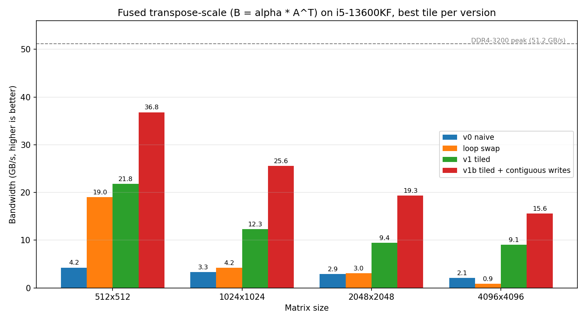

# KernelForge

High-performance CPU kernels for the core operations behind neural networks,
written in C and optimized step by step: cache tiling, AVX2 SIMD, and OpenMP.

## Results (summary)

| Kernel | Best version | Speedup vs naive | % of hardware limit |
|---|---|---|---|
| Transpose-scale | v1b, tiled + contiguous writes (tile 32) | 7.5x at 4096 | ~30% of DDR4 peak |
| GEMM | _tbd_ | _tbd_ | _tbd_ |
| Softmax | _tbd_ | _tbd_ | _tbd_ |
| LayerNorm | _tbd_ | _tbd_ | _tbd_ |

## Test machine

- CPU: Intel Core i5-13600KF (6 P-cores + 8 E-cores, AVX2)
- RAM: 32 GB DDR4-3200, dual channel (theoretical peak 51.2 GB/s)
- OS: Ubuntu on WSL2, GCC, `-O2 -march=native`

## Build and run

```bash
cmake -B build
cmake --build build
./build/test_transpose            # correctness
./build/bench_transpose           # performance (run from repo root)
python3 python/plot_transpose.py  # chart -> results/transpose.png
```

## Kernel 1: Fused transpose-scale (B = alpha * A^T)



*Best tile size shown for each tiled version. All versions verified against the naive reference.*

**The problem.** Transposing a matrix means reading along rows of A but writing down columns of B. In the naive version (v0), every write jumps a full row ahead in memory, touching a new 64-byte cache line just to store 4 bytes. At 4096x4096 it reaches only 2.1 GB/s, about 4% of what the RAM can deliver.

**What I tried:**

| Version | Idea | 4096x4096 |
|---|---|---|
| v0 naive | Reads contiguous, writes scattered | 2.1 GB/s |
| loop swap | Writes contiguous, reads scattered | 0.9 GB/s (2.5x *slower*) |
| v1 tiled | 32x32 blocks to stay in cache | 3.7 GB/s (tile 32), 9.1 GB/s (tile 8) |
| **v1b** | **Tiling + contiguous writes inside each tile** | **15.6 GB/s (7.5x faster)** |

**Key findings:**

1. **Scattered writes cost more than scattered reads, until the data no longer fits in cache.** The loop swap was 4.5x faster than naive at 512x512, where everything fits in L2, but 2.5x slower at 4096x4096. Writes to a missing cache line force the CPU to fetch the line first, which makes them expensive; but writes can be buffered, while reads stall the CPU until data arrives from RAM.

2. **Combining two mediocre ideas beat both.** Tiling keeps the scattered reads inside L1 cache, so the benefit of contiguous writes finally shows up. v1b is 4x faster than v1 at 4096.

3. **Cache associativity sets a hard limit on tile size.** At power-of-two sizes, every row of a tile maps to the same L1 cache set, which holds only 12 lines. In v1, tile 8 (8 lines) fits and reaches 9.1 GB/s, but tile 16 and above overflow the set and drop to about 3.7 GB/s. The cliff appears at exactly the tile size the 12-way theory predicts, including at 512x512, where the lines spread over 2 sets and the cliff moves to tile 32.

4. **Tile 32 is the sweet spot for v1b.** Tile sizes 8 through 128 were tested; 8 wastes half of each cache line and 128 (128 KB) overflows the 48 KB L1.

**What's next.** The best version still processes one float per instruction and uses one core, reaching about 30% of the 51.2 GB/s DDR4

## Motivation

Libraries like OpenBLAS and Intel MKL make these operations fast, but they hide *why* they're fast. I built KernelForge to find out by doing: writing each kernel from scratch, optimizing it one technique at a time, and measuring every step against the hardware limits of my own machine.

The goal is understanding, not replacing production libraries. Every finding below comes from benchmarks I ran and explained myself.
